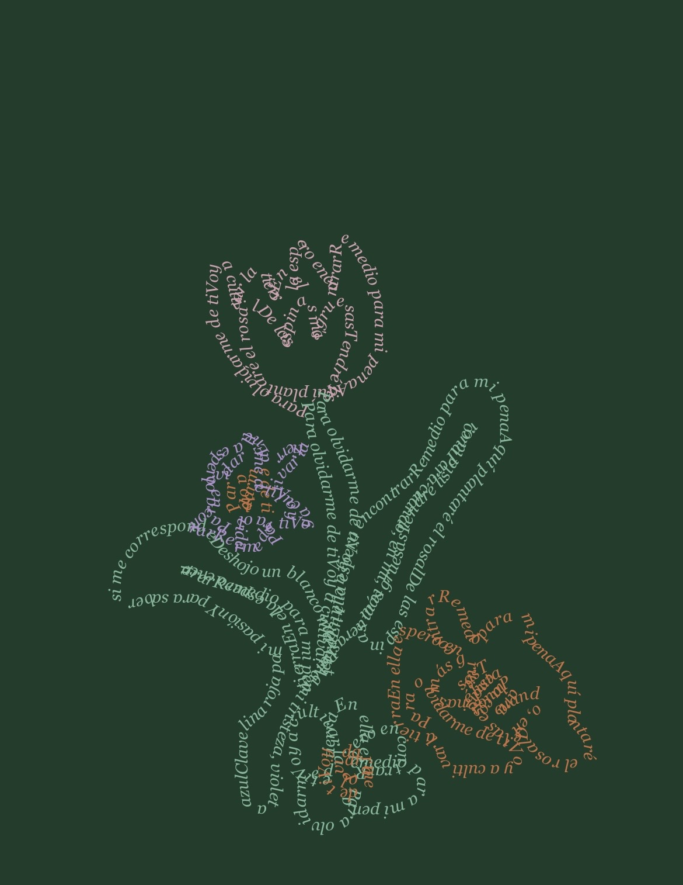

# siluetra

*¿qué forma tiene una palabra?*

el trazo se vuelve texto. el texto, figura. las palabras no describen la forma, la son.

la composición manda. el texto es el material, no el mensaje.

https://github.com/user-attachments/assets/9cb4a9c7-2e7d-48a8-96eb-80c1551a8b6d

## dibujador

herramienta visual para dibujar con texto. puedes partir de una imagen de referencia o de un lienzo en blanco. escribe, compón y exporta como HTML con SVG incrustado.

## flujo

1. sube una imagen de referencia si quieres
2. dibuja sobre el lienzo
3. escribe tu texto
4. exporta — HTML con SVG incrustado

## versión

v0.1 — texto sobre trazo, exportación SVG

## licencia

MIT — libre para usar, modificar y redistribuir con atribución.
